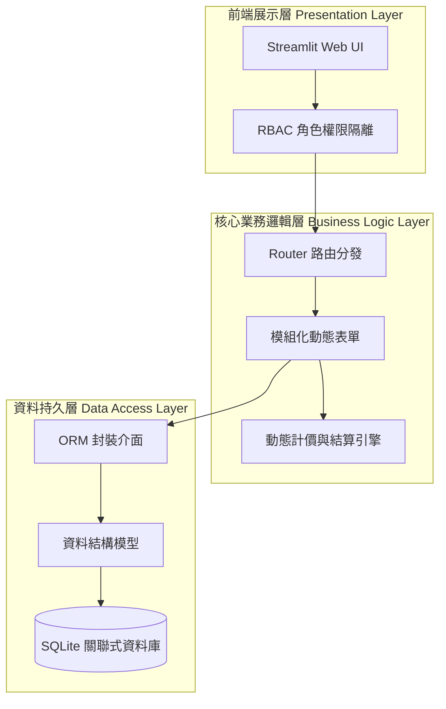
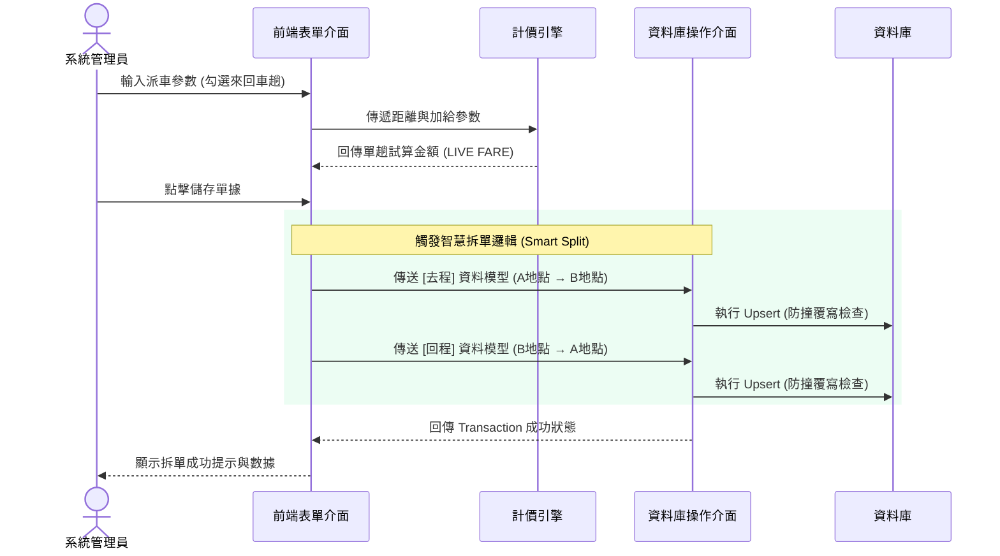
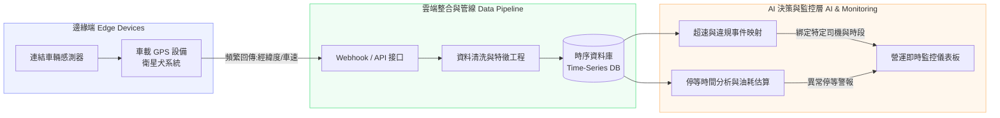

# FleetFlow 乖乖智慧派車與薪資管理系統
**GuaiGuai Dispatch & Payroll Management System**


## 專案簡介
GuaiGuai FleetFlow Dispatch 是一套專為乖乖運輸派車公司所設計的 SaaS 基礎架構管理系統。
傳統派車運輸貨運業長期仰賴紙本手寫記錄，面臨派車資訊破碎不統一、複雜加給（如早夜班、超時、冷凍板）計算繁雜，以及人手不足缺乏會計導致薪資結算易出錯等痛點。本系統以「乖乖運輸」面臨的真實商業場景案例，透過高度模組化的架構與前後端分離思維，將複雜的商業計費邏輯數位化。系統提供即時的數據試算與高穩定性的資料存儲，大幅降低企業營運的人力成本與提高容錯率。

---

## 系統總體架構
本系統採用微服務概念與 MVC 設計模式，將前端渲染、核心商業邏輯與資料持久層嚴格分離。此架構不僅確保了現階段系統的輕量化與高內聚性，也為未來的大規模資料擴充保留了彈性。



---

## 核心功能與資料流亮點
* **角色基礎存取控制 & 狀態管理**
  採用 `bcrypt` 進行密碼雜湊加密，實作安全的訪客隔離模式，利用 Session State 控管全域狀態，防止測試操作誤觸正式資料庫。
* **安全與防呆的資料持久層**
  採用 SQLAlchemy ORM 捨棄傳統 SQL 拼接，防止 SQL Injection。實作 Upsert 防撞覆寫邏輯與強制時間戳記，確保資料一致性。
* **複雜金額邏輯實作**
  針對來回車趟情境開發智慧拆單演算法。系統會在記憶體中攔截資料，進行起訖點映射反轉，嚴謹地拆分為去程與回程兩筆紀錄，確保底層資料的原子性。

### 智慧拆單演算法資料流


---

## 目錄結構
```text
truck_dispatch_system/
├── app.py                 # 應用程式入口與 Router 路由分發
├── config.py              # 全局環境變數與 SaaS 風格 UI 樣式設定
├── auth.py                # 系統安全認證與 RBAC 權限控管
├── calculator.py          # 核心商業邏輯與動態計價引擎
├── crud.py                # SQLAlchemy ORM 資料庫操作封裝
├── models.py              # 資料庫 Table 結構與 Schema 定義
├── requirements.txt       # 系統環境依賴套件清單
├── components/            # 前端 UI 模組化元件庫
│   ├── header.py          # 頁首與標題渲染
│   ├── cards.py           # 報價與薪資試算資訊卡片
│   ├── tables.py          # 報表與資料表格渲染
│   └── forms.py           # 表單輸入與業務邏輯整合
└── data/                  # SQLite 資料庫儲存目錄
```

---

## 安裝與執行指引
**1. 複製專案**
```bash
git clone https://github.com/kent891026/fleetflow.git
cd fleetflow
```

**2. 建立虛擬環境**
```bash
python -m venv venv
source venv/bin/activate  # Linux/Mac 用戶
venv\Scripts\activate     # Windows 用戶
```

**3. 安裝依賴套件**
```bash
pip install -r requirements.txt
```

**4. 啟動系統**
```bash
streamlit run app.py 
# 系統將自動於瀏覽器開啟 http://localhost:8501
```

---

## 未來展望與進階架構
本專案目前已完成核心的資訊建置，未來的進階研究目標將引入即時追蹤，升級為完整的連網車隊追蹤系統。



1. **IoV 車聯網整合**：預計與「衛星犬」進行 API 串接，建立 InfluxDB 等時序資料庫，即時追蹤車輛動態。
2. **司機行為建模**：將 GPS 車速與停等數據，與系統內部的出車時段進行特徵值映射，自動識別異常怠速或超速違規行為。
3. **機器學習輔助決策**：收集長期的派車路徑與時間成本數據，訓練機器學習模型，實現精準的「車輛路徑最佳化 (VRP)」與「卸貨時間預測」。

---

## 作者
**陳致穎 (Chen Chih-Ying)**
* Bachelor of Architecture, National Yunlin University of Science and Technology
* Email: kent891026@gmail.com
* GitHub: [kent891026](https://github.com/kent891026)

*專案建置於 2026 年，為學術展示與軟體工程實踐專案紀錄*